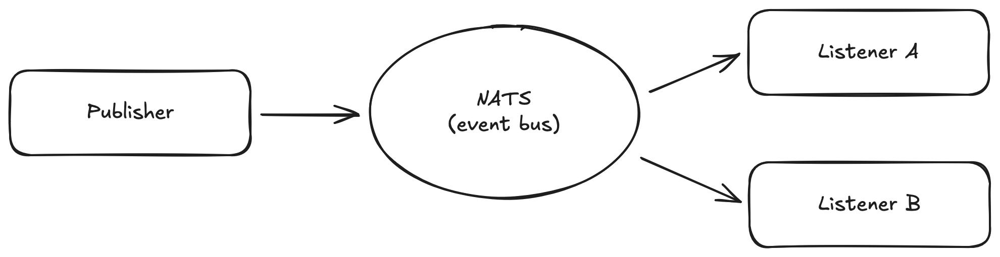

# *work in progress*


Write description here...

### Tech Stack

- [Typescript](https://www.typescriptlang.org/)
- [Docker](https://www.docker.com/)
- [Kubernetes](https://kubernetes.io/)
- [Express](https://expressjs.com/)
- [Skaffold](https://skaffold.dev)
- [Jest](https://jestjs.io/)
- [Next.js](https://nextjs.org/)
- [MongoDB](https://www.mongodb.com/)
- [Redis](https://redis.io/)
- [NATS Streaming Server](https://hub.docker.com/_/nats-streaming)
- [Ingress Nginx](https://kubernetes.github.io/ingress-nginx/)

### Features

- Common/shared NPM module
- JWT auth
- ...

###  Architecture

Should probably start with a diagram that shows the flow of requests as well. So I can show that a request comes in and is caputred by ingress nginx and redirects traffic within the kubernetes cluster. Then I can do a section explaining how the cluster transmits events to other services. Also add in a quick disclaimer on why NATS compared to some other event bus.


#### Request Flow

Our application has a single entrypoint (our Next.js frontend). This is where the user makes requests do things like buy or sell a item. In order to manage all of the different kinds of request within our application, we use NGINX as an ingress controller. This maps our requests to the correct microservice within our Kubernetes cluster. 


### Asynchronous Event-based Communication using NATS Streaming Server



I can describe the flow of events here. 

- round-robin listeners using queue groups
- retry when we don't ack
- stores all events. sends all events to new service and can send only un-ackd events to listeners if they go down for some period of time


### Local Development

To get started locally, first ensure that you have Docker, Kubernetes, and Skaffold installed.

```
skaffold dev
```

To view our application code in dev mode we need to be able to go to something like localhost:1234 in our browser. We cannot do this in Kubernetes as there is no 'localhost'. Instead we can tell Kubernetes to output to something like mysite.com and then on our machine we can set a configuration so that when we navigate to mysite.com we are actually shown our local 127.0.0.1 instead of the real mysite.com. To get this done, open your /etc/hosts file (its a file not a folder) and add:

```
127.0.0.1 mysite.com
```

or whatever site you want. Then in your `ingress-srv.yaml` file just make sure that the host is set to this site. This is how NGINX knows where to send traffic.
