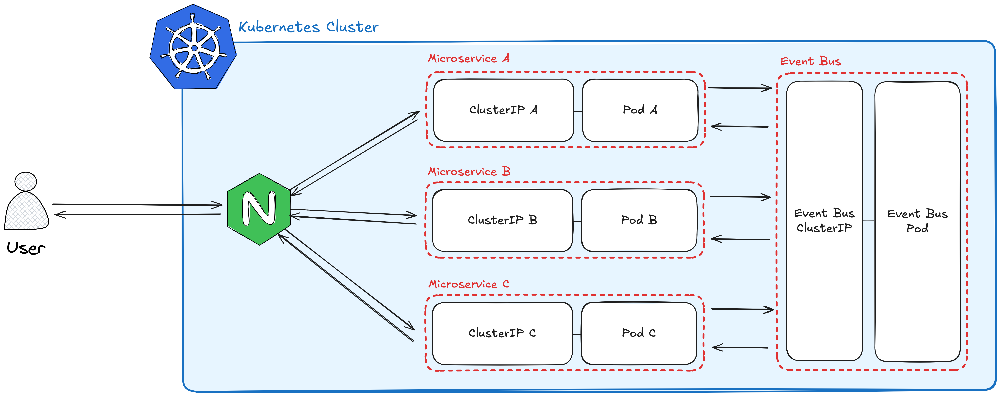
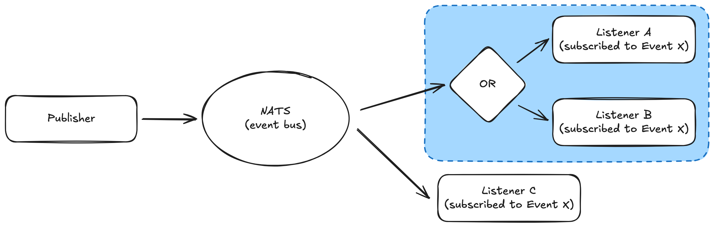

This is a Node.js microservices e-commerce platform for buying and selling digital items. It uses the publish/subscribe (pub/sub) communication pattern with an asynchronous event bus. The system supports order reservation with automatic expiration to prevent double-spending.

Additional features:

- User authentication and authorization
- Stripe-powered payments
- Per-service automated tests with Jest
- CI/CD pipelines via GitHub Actions

### Tech Stack

- [Typescript](https://www.typescriptlang.org/)
- [Node.js](https://nodejs.org/en)
- [Express](https://expressjs.com/)
- [Next.js](https://nextjs.org/)
- [Docker](https://www.docker.com/)
- [Kubernetes](https://kubernetes.io/)
- [Skaffold](https://skaffold.dev)
- [NATS Streaming Server](https://hub.docker.com/_/nats-streaming)
- [Ingress Nginx](https://kubernetes.github.io/ingress-nginx/)
- [Redis](https://redis.io/)
- [MongoDB](https://www.mongodb.com/) + [Mongoose](https://mongoosejs.com/)
- [Jest](https://jestjs.io/)

### Architecture

#### High-Level Overview



- At a high level, the app is composed of six microservices that communicate using the pub/sub pattern over an asynchronous event bus.
  - Each microservice runs inside its own Docker container.
  - Containers are deployed into Kubernetes Pods.
  - External traffic is routed into the correct Pod through Ingress Nginx.
  - Everything runs inside a single Kubernetes cluster.

#### Pub/Sub Communication



Services communicate through events using the publish/subscribe pattern, implemented with NATS Streaming.

- When something happens inside a service, it publishes an event describing that action.
- Other services subscribe to these events and react accordingly.

Key features of NATS Streaming in this system:

- Persistent append-only log for events, enabling replay
- Acknowledgement and retry mechanisms for reliable delivery
- Queue groups for round-robin load balancing across subscribers

### Local Development

To get started locally, first ensure that you have Docker, Kubernetes, and Skaffold installed. You can start the app by running:

```
skaffold dev
```

When running locally, you can’t simply visit `localhost:1234` in the browser because Kubernetes does not expose services on `localhost`. Instead, you can map a custom domain to your local machine.

1. Open your `/etc/hosts` file (it’s a file, not a folder).
2. Add an entry like:

```
127.0.0.1 mysite.com
```

1. Update your `ingress-srv.yaml` file so the host matches `mysite.com`.
2. Now, when you visit `http://mysite.com` in your browser, traffic will be routed by Nginx to the correct service inside Kubernetes.